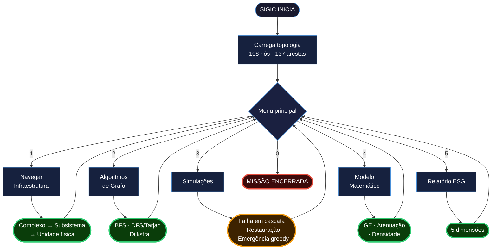

# ☄️ SIGIC — Sistema Inteligente de Gerenciamento da Infraestrutura da Colônia


*Atividade Integradora · Fase 4 · Ciência da Computação, 2026 — FIAP*

🧑‍🚀 [Julia Ramos | RM568988](https://www.linkedin.com/in/juliaramosguedes) · [Matheus Fuchelberguer | RM569113](https://www.linkedin.com/in/matheus-fuchelberguer-neves/) · [Carlos Eugenio Andrade | RM570285](https://www.linkedin.com/in/carloseugenioandrade/) · [Rodrigo Gomes Dias | RM569142](https://www.linkedin.com/in/rodrigogmdias/)
---

   

SIGIC — Sistema Inteligente de Gerenciamento da Infraestrutura da Colônia. Aurora Siger cresceu: de 6 pessoas e 46 kW na Fase 3 para 1.000 habitantes, 10 complexos e 1.030 kW em operação contínua. O SIGIC modela esta infraestrutura como um grafo de 108 nós e 137 arestas — e analisa conectividade, pontes críticas, rotas de menor custo e sustentabilidade energética para manter a colônia funcionando indefinidamente.

> [!IMPORTANT]
> O desafio não é mais sobreviver — é manter 1.000 pessoas conectadas. Com 137 arestas sustentando 108 módulos em operação contínua, uma falha estrutural pode isolar setores inteiros. O SIGIC mapeia a rede, detecta pontes, calcula rotas e emite o relatório ESG. A colônia continua porque alguém está de olho no grafo.

---

## 🛸 Pipeline

```
Topologia (108 nós · 137 arestas) → Exploração (drill-down 3 níveis) → Algoritmos (BFS · DFS/Tarjan · Dijkstra) → Simulações (falha · restauração · emergência) → Modelo Matemático → ESG
```

1. **Topologia** — cenário carregado por `build_colony_network()` em `scenarios.py`; hierarquia de 3 camadas (complexo → subsistema → unidade física) gerada por `expand()`
2. **Exploração** — navegação interativa com drill-down em 3 níveis; status, consumo e prioridade exibidos por nó
3. **BFS** — `bfs_shortest_path`: caminho de menor número de saltos entre dois módulos; `is_network_connected`: verifica se toda a rede é alcançável
4. **DFS + Tarjan** — `find_bridges`: detecta arestas cuja remoção desconecta a rede (`low_link[v] > discovery_time[u]`)
5. **Dijkstra** — três critérios de peso: `DISTANCE` (metros), `ENERGY` (kW), `LATENCY` (ms); min-heap com `heapq`
6. **Simulações** — falha em cascata (`cascade_offline`), restauração (`cascade_restore`), gestor de emergência greedy por prioridade
7. **Modelo matemático** — eficiência global (GE), atenuação energética por rota, densidade da rede
8. **ESG** — relatório de 5 dimensões: energia sustentável, infraestrutura, sistemas críticos, governança, eficiência

> [!CAUTION]
> O grafo tem ~76 pontes estruturais. Uma única ponte desconectada pode isolar dezenas de módulos dependentes. Em Marte, isolamento não é inconveniente — é missão encerrada. **Resistência é inútil.**



---

## 🛰 Arquitetura

**Grafo como modelo central** — `ColonyNetwork` é um grafo não-direcionado ponderado. Cada nó é um `Module` com status, prioridade e consumo; cada aresta é uma `Edge` com distância, custo energético e latência. O grafo é construído uma vez e não é mutado durante análise — funções recebem e retornam.

**Funções puras** — BFS, DFS, Dijkstra e todos os modelos matemáticos recebem o grafo como parâmetro e retornam resultados sem modificar estado. Cada algoritmo é testável individualmente — mandatório para sistemas de infraestrutura crítica.

**Fonte única da verdade** — todos os limiares topológicos, constantes físicas e parâmetros de escalonamento definidos em `src/constants.py`. Nenhum magic number no código.

**Separação estrita por responsabilidade** — `scenarios.py` constrói; `graph.py` opera; `bfs.py` / `dfs.py` / `dijkstra.py` percorrem; `math_model.py` calcula; `display.py` exibe. Nenhum módulo conhece o funcionamento interno do outro.

**Deque O(1)** — `get_descendants` usa `deque` para BFS hierárquico. Push e pop O(1) em ambas as extremidades — sem o antipadrão `list.pop(0)` que é O(n).

> [!IMPORTANT]
> **Hierarquia determinística** — `expand()` gera nó de grupo + N folhas + N arestas internas a partir de um único call. `build_colony_network()` é determinística: sempre produz o mesmo grafo, auditável e reprodutível.

---

## O que é o SIGIC

O SIGIC é o sistema computacional que gerencia a infraestrutura física da colônia Aurora Siger.
Enquanto a Fase 3 (MGAB) simulou o ciclo energético autônomo de uma colônia de 6 pessoas,
a Fase 4 (SIGIC) modela a infraestrutura expandida de 1.000 habitantes como um grafo ponderado
— permitindo análise de conectividade, resiliência estrutural, rotas críticas e sustentabilidade.

O sistema opera de forma interativa: navega a hierarquia de módulos, aplica os três algoritmos
de grafo, simula falhas em cascata e emite relatório ESG com 5 dimensões. Toda análise é
determinística e reprodutível.

---

## A colônia

Aurora Siger opera com 1.000 habitantes, dimensionada segundo Musk (2017) — capacidade inicial
da configuração de transporte SpaceX Starship — e posicionada em um dos três melhores locais
de geração eólica de Marte (Hartwick et al., Nature Astronomy, 2023).

### Módulos e prioridades

Todos os 108 módulos operam 24h de forma autônoma. Desligamentos são exclusivamente
por decisão operacional — nunca por horário.

| Complexo | Prioridade | Consumo total | Subsistemas |
|---|---|---|---|
| CTL — Centro de Controle | P1 — inviolável | 15,0 kW | standalone |
| PWR — Complexo de Energia | P1 — inviolável | 27,0 kW | SOL WND BAT DST |
| LSS — Suporte de Vida | P1 — inviolável | 505,0 kW | ATM WAT |
| HAB — Complexo Habitacional | P2 — crítico | 85,0 kW | QRT REC DIN EDU |
| MED — Complexo Médico | P2 — crítico | 106,0 kW | EMG SRG ICU CLN DEN PSY |
| COM — Sistema de Comunicação | P3 — essencial | 45,0 kW | INT EXT TOR |
| AGR — Complexo de Agricultura | P3 — essencial | 63,0 kW | GRH FPR |
| LOG — Complexo de Logística | P4 — operacional | 50,0 kW | TRN WRH EVA |
| MIN — Mineração ISRU | P4 — operacional | 93,0 kW | DRL REF RST |
| RES — Centro de Pesquisa | P5 — pesquisa | 41,0 kW | GEO AGT BIO ENV |

**Consumo total nominal: 1.030 kW** (1,03 kW/pessoa) — redução de 7,67 kW/pessoa (Fase 3)
para 1,03 kW/pessoa reflete economias de escala da infraestrutura compartilhada.
Escalonamento completo documentado em [`docs/scaling-rationale.md`](docs/scaling-rationale.md).

---

## Infraestrutura energética

### Por que solar e eólica juntas?

Solar domina durante o dia; zero à noite. Eólica opera 24h e aumenta durante tempestades de
poeira — quando o sol cai, o vento compensa. Baterias cobrem o déficit de noites calmas
(40% das noites, segundo NASA NTRS 19790057281). A complementaridade das três fontes é a
arquitetura descrita por Hartwick et al. (2023).

### Localização

Aurora Siger está posicionada em um dos três melhores locais de geração eólica de Marte
(Hartwick et al., 2023). Nesses locais, a turbina E33 produz em média 24 kW — porque a
densidade do ar marciano (0,017 kg/m³) é 1,4% da terrestre, e apenas nesses locais a
velocidade média supera o cut-in adaptado de 10,3 m/s ao longo de todo o ano marciano.

### Configuração instalada

| Componente | Quantidade | Especificação | Fonte |
|---|---|---|---|
| Campos solares | 3 × 2.900 m² | 29% eficiência; irradiância 500 W/m² | arXiv:2410.00066 + escala |
| Turbinas eólicas | 26 × E33 (33,4 m) | ~24 kW/turbina nos top-3 locais | Hartwick et al. (2023) |
| Bancos de bateria | 52 × 312 kWh | 80% DoD operacional | arXiv:2410.00066 + cálculo |

26 turbinas escalonadas da Fase 3 (2 turbinas): `SCALE_FACTOR = (1000/6)^0.5 = 12,91 → 26`.
52 bancos dimensionados pelo pior caso: `1.030 kW × 12,6h / 0,80 = 16.222 kWh → ⌈16.222/312⌉ = 52`.

### Balanço energético

| Período | Geração | Consumo | Balanço |
|---|---|---|---|
| Dia (nominal) | 1.262 kW solar + 624 kW eólica | 1.030 kW | +856 kW — carrega baterias |
| Noite com vento (60% das noites) | 0 + 624 kW | 1.030 kW | −406 kW → 31,9h autonomia |
| Noite calma (40% das noites) | 0 + 0 kW | 1.030 kW | −1.030 kW → **12,6h — CRÍTICO** |
| Margem média 24h | 615 kW + 624 kW = 1.239 kW | 1.030 kW | **1,20×** |

---

## 📡 Modelos Matemáticos

| Fenômeno | Modelo | Arquivo |
|---|---|---|
| Eficiência global da rede | `GE = (1/n(n−1)) × Σ_{i≠j} [1/d(i,j)]` | `src/math_model.py` |
| Custo energético com atenuação | `P_rota = Σ_e [P_e × (1 + α × d_e/1000)]`  · α = 0,05 kW/km | `src/math_model.py` |
| Densidade da rede | `δ = 2\|E\| / (\|V\| × (\|V\|−1))`  · atual: 0,0237 (2,37%) | `src/math_model.py` |
| Escalonamento (lei de potência) | `C_N = C_6 × (N/6)^α`  · α = 0,5 infra; α = 0,7 LSS | `src/constants.py` |

---

## 🌙 Estruturas de Dados

| Estrutura | Tipo | Papel |
|---|---|---|
| `ColonyNetwork` | dataclass (`dict[str, Module]` + `list[Edge]`) | Grafo não-direcionado ponderado — toda a infraestrutura da colônia |
| Adjacência | `dict[str, list[Edge]]` — derivado lazy | Lookup O(1) de vizinhos por ID de módulo |
| `visited` | `set[str]` | BFS/DFS: marcação O(1) de nós visitados |
| `queue` | `deque[str]` | BFS — FIFO com enqueue/dequeue O(1) em ambas as extremidades |
| `dist` | `dict[str, float]` | Dijkstra: distâncias mínimas acumuladas por nó |
| `heap` | `list[(float, str)]` — `heapq` | Dijkstra: min-heap de (custo, nó) — O(log V) por operação |
| `discovery_time`, `low_link` | `dict[str, int]` | Tarjan: timestamps DFS e low-link para detecção de pontes |

---

## ⭐ Algoritmos

| Algoritmo | Arquivo | Uso | Complexidade |
|---|---|---|---|
| BFS — Busca em largura | `src/bfs.py` | Caminho mínimo por saltos; conectividade; alcançabilidade | O(V + E) |
| DFS + Tarjan | `src/dfs.py` | Pontes — arestas cuja remoção desconecta o grafo | O(V + E) |
| Dijkstra | `src/dijkstra.py` | Caminho mínimo ponderado (distância / energia / latência) | O((V + E) log V) |

**Tarjan para pontes:** uma aresta (u, v) é ponte se `low_link[v] > discovery_time[u]`.
`low_link[v]` é o menor discovery_time alcançável a partir de v por arestas de retorno.
Se v não consegue "voltar" para trás de u, a remoção de (u, v) desconecta o grafo.

**Dijkstra com 3 critérios:** `WeightType.DISTANCE`, `.ENERGY` e `.LATENCY` — a mesma
implementação de heap; apenas o campo da aresta lido muda. `dijkstra_all_distances` executa
Dijkstra de cada nó ativo para todos os outros: base do cálculo de eficiência global, O(V × (V+E) log V).

---

## 🚀 Como executar

Requer `rich` para renderização no terminal.

```bash
cd fiap_fase_4_aurora_siger
pip install rich
python main.py
```

| Opção | Função |
|---|---|
| [1] Navegar infraestrutura | Drill-down em 3 níveis: complexo → subsistema → unidade física |
| [2] Algoritmos de grafo | BFS (saltos), DFS/Tarjan (pontes), Dijkstra (distância · energia · latência) |
| [3] Simulações | Falha em cascata, restauração, gestor de emergência energética greedy |
| [4] Modelo matemático | Eficiência global (GE), atenuação energética por rota, densidade da rede |
| [5] Relatório ESG | 5 dimensões: energia sustentável, infraestrutura, sistemas críticos, governança, eficiência |
| [0] Encerrar missão | — |

> [!NOTE]
> **Apresentação:** [youtu.be/WEZOV2iZdV4](https://youtu.be/WEZOV2iZdV4?si=dUVbxz9tDLneZMi8) — demonstração completa do SIGIC em execução.

> [!NOTE]
> Única dependência externa: `rich` para UI. Todos os algoritmos e modelos matemáticos usam biblioteca padrão Python. `build_colony_network()` é determinística — o mesmo grafo é produzido a cada execução.

---

## Exemplo de saída

```
╔═══════════════════════════════════════════════════════════════╗
║  ☄️  SIGIC — AURORA SIGER                                      ║
║  Sistema Inteligente de Gerenciamento da Infraestrutura       ║
╚═══════════════════════════════════════════════════════════════╝

  [1] Navegar infraestrutura
  [2] Algoritmos de grafo
  [3] Simulações
  [4] Modelo matemático
  [5] Relatório ESG
  [0] Encerrar missão

> 5

━━━━━━━━━━━━━━━━━━━━━━━━━━━━━━━━━━━━━━━━━━━━━━━━━━━━━━━━━
  ☄️  RELATÓRIO ESG — AURORA SIGER SIGIC
━━━━━━━━━━━━━━━━━━━━━━━━━━━━━━━━━━━━━━━━━━━━━━━━━━━━━━━━━

  ⚡ ENERGIA SUSTENTÁVEL
     Módulos com consumo ≥ 20,0 kW (HIGH_CONSUMPTION_KW)
     ● ATM-01  Controle Atmosférico     90,0 kW  ⚠
     ● ATM-02  Controle Atmosférico     90,0 kW  ⚠
     ● ATM-03  Controle Atmosférico     90,0 kW  ⚠
     ● WAT-01  Reciclagem de Água       60,0 kW  ⚠
     ● WAT-02  Reciclagem de Água       60,0 kW  ⚠
     ● WAT-03  Reciclagem de Água       60,0 kW  ⚠
     ● ICU     UTI                      30,0 kW  ⚠
     ● DRL-01  Operações de Perfuração  20,3 kW  ⚠
     ● DRL-02  Operações de Perfuração  20,3 kW  ⚠

  🏗 INFRAESTRUTURA
     Módulos ativos:    108 / 108
     Densidade da rede: 2,37%   ● IDEAL  [1,5% – 8,0%]

  ● SISTEMAS CRÍTICOS (P1)
     CTL ● OPERACIONAL   PWR ● OPERACIONAL   LSS ● OPERACIONAL
     Todos os módulos P1 em operação  ✔

  ☄️ GOVERNANÇA
     Pontes detectadas: 76   ⚠ acima de 40 — revisar redundâncias estruturais
     Componente conectado principal:  108 nós  ✔

  📡 EFICIÊNCIA
     Eficiência Global (GE): 0,0031   ● OPERACIONAL  [limiar ≥ 0,002]
```

---

## 🌌 Estrutura

```
fiap_fase_4_aurora_siger/
├── main.py                    ← entry point — menu interativo, carrega topologia
├── ENGINEERING_GUIDE.md       ← walkthrough técnico completo para engenheiros
├── src/
│   ├── constants.py           ← constantes físicas, limiares, escalonamento Fase 3 → Fase 4
│   ├── enums.py               ← ModuleStatus, EdgeType, WeightType + enums Fase 3
│   ├── models.py              ← Module, Edge, ColonyNetwork (dataclasses frozen)
│   ├── scenarios.py           ← build_colony_network() · expand() · topologia de referência
│   ├── graph.py               ← operações hierárquicas: get_descendants, cascade_offline, emergência
│   ├── bfs.py                 ← BFS traversal, caminho por saltos, conectividade
│   ├── dfs.py                 ← DFS traversal, find_bridges (Tarjan)
│   ├── dijkstra.py            ← caminho mínimo ponderado (distância · energia · latência)
│   ├── math_model.py          ← eficiência global, atenuação energética, densidade
│   └── display.py             ← UI Rich — navegação, algoritmos, simulações, ESG
└── docs/
    ├── ENGINEERING_GUIDE.md   ← guia técnico principal
    ├── energy-reference.md    ← geração, armazenamento e balanço energético
    ├── modules-reference.md   ← 10 complexos com consumo, prioridade e justificativas
    ├── topology-reference.md  ← grafo, hierarquia, algoritmos, modelos matemáticos
    └── scaling-rationale.md   ← ponte científica Fase 3 → Fase 4 (lei de potência)
```

---

## Critérios da atividade atendidos

| Critério | Implementação |
|---|---|
| Grafo e topologia | `ColonyNetwork` — grafo não-direcionado ponderado; 108 nós em hierarquia de 3 camadas; 137 arestas em 4 categorias; densidade 2,37% |
| Algoritmos de busca | BFS O(V+E) — caminho por saltos; DFS + Tarjan O(V+E) — detecção de pontes; Dijkstra O((V+E)log V) — 3 critérios de peso |
| Modelos matemáticos | Eficiência global (Latora & Marchiori, 2001); atenuação energética (NASA ICES-2023-311); densidade de rede |
| Infraestrutura energética | 1.030 kW para 1.000 pessoas; solar + eólica + 52 bancos; escalonamento lei de potência documentado da Fase 3 |
| Relatório ESG | 5 dimensões: energia sustentável, infraestrutura, sistemas críticos, governança, eficiência global |
| Implementação Python | Funções puras; dataclasses frozen; deque O(1); separação por responsabilidade; Rich para UI |

---

## 🔭 Referências

| Parâmetro | Fonte |
|---|---|
| Top-3 locais eólicos de Marte; 24 kW/turbina | Hartwick, V. L. et al. — *Nature Astronomy* (2023) |
| Colônia de 1.000 pessoas — capacidade inicial Starship | Musk, E. — *New Space*, 5(2), 2017 |
| Fórmula de eficiência global (GE) | Latora, V.; Marchiori, M. — *Physical Review Letters* 87(19), 2001 |
| Algoritmo de pontes por DFS | Tarjan, R. E. — *SIAM J. Comput.* 1(2), 1972 |
| Coeficiente de atenuação energética em Marte | NASA — ICES-2023-311 (2023) |
| Painel solar 29% eficiência; bateria 312 kWh (baseline Fase 3) | arXiv:2410.00066 |
| Baseline de 6 pessoas, 46 kW (Fase 3 — fonte da verdade) | Drake — *NASA DRA 5.0* (2009) |
| Consumo ECLSS para 6 pessoas | NASA ECLSS — NTRS 20230002103 |
| Vento noturno abaixo do cut-in (Viking Lander 2) | NASA — NTRS 19790057281 |
| Irradiância solar na superfície marciana | Appelbaum & Flood — *NASA TM-102299* (1989) |

> [!NOTE]
> Consulte [`docs/energy-reference.md`](docs/energy-reference.md) para o balanço energético detalhado, [`docs/topology-reference.md`](docs/topology-reference.md) para os algoritmos e modelos matemáticos, [`docs/modules-reference.md`](docs/modules-reference.md) para o consumo de cada complexo, e [`docs/scaling-rationale.md`](docs/scaling-rationale.md) para a metodologia de escalonamento Fase 3 → Fase 4.

---

> [!IMPORTANT]
> *"A complexidade de um sistema não é fraqueza — é o mapa de suas possibilidades."* 🖖
